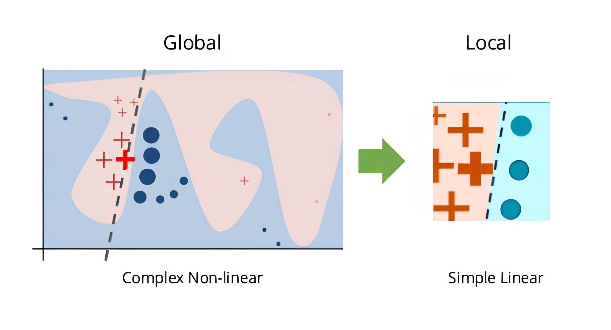

# Text Classification with Logistic Regression and LIME

## Introduction à LIME

**LIME (Local Interpretable Model-agnostic Explanations)** est une méthode utilisée pour interpréter les prédictions des modèles de machine learning. Son objectif est de rendre les modèles complexes plus transparents en expliquant leurs prédictions individuelles.

### Comment fonctionne LIME ?

1. **Perturbation de l'entrée d'origine**  
   **Objectif** : Créer un échantillon local de données similaires à l'exemple à expliquer.  
   **Méthode** :  
   - Dans le cas des textes : LIME modifie le texte en supprimant ou en masquant certains mots pour générer des exemples proches mais légèrement différents.  
   - Dans le cas des images : LIME masque ou altère certaines zones de l'image.  
   Chaque nouvel exemple est passé au modèle pour obtenir sa prédiction (probabilités des classes).

2. **Calcul de la similarité locale**  
   **Objectif** : Donner plus de poids aux exemples perturbés qui sont proches de l'entrée d'origine.  
   **Méthode** :  
   - LIME utilise une fonction de similarité (par exemple, une mesure basée sur la distance cosinus) pour attribuer un poids à chaque exemple perturbé en fonction de sa proximité avec l'exemple original.

3. **Construction d'un modèle interprétable**  
   **Objectif** : Approcher le comportement du modèle complexe sur les données perturbées à l’aide d’un modèle simple.  
   **Méthode** :  
   - LIME entraîne un modèle interprétable (comme une régression linéaire ou un arbre de décision) sur les exemples perturbés pondérés par leur similarité.  
   - Ce modèle simple est ajusté uniquement pour expliquer l’entrée analysée (localement).

4. **Extraction des contributions des caractéristiques**  
   **Objectif** : Identifier les caractéristiques (par exemple, les mots) ayant le plus d’influence sur la prédiction.  
   **Méthode** :  
   - Les coefficients du modèle interprétable indiquent l’impact de chaque caractéristique (positif ou négatif) sur la probabilité de la classe prédite.

5. **Visualisation des résultats**  
   **Objectif** : Présenter les résultats sous une forme compréhensible pour l’utilisateur.  
   **Méthode** :  
   - LIME génère une liste ou un graphique montrant les caractéristiques les plus influentes et leur contribution à la prédiction.

### Illustration

  

---

## Description du projet

Ce projet utilise un modèle de **régression logistique** pour classifier des textes en deux catégories, basé sur un sous-ensemble du jeu de données **20 Newsgroups**. Le modèle est interprété avec **LIME**, qui identifie les mots ayant le plus d'impact sur les prédictions.

---

## Fonctionnalités

- **Prétraitement des textes :** Transformation des textes en vecteurs numériques avec TF-IDF.
- **Classification :** Utilisation d'un modèle de régression logistique.
- **Explicabilité :** Analyse des prédictions avec LIME.

---

## Bibliothèques utilisées

- **`numpy`** : Pour les calculs numériques.
- **`matplotlib`** : Pour la visualisation des résultats.
- **`scikit-learn`** : Pour le prétraitement des données, le modèle de classification et le jeu de données.
- **`lime`** : Pour l'interprétation des prédictions.

---

## Étapes du pipeline

1. **Chargement des données :**
   - Extraction des textes de deux catégories du jeu de données **20 Newsgroups**.

2. **Prétraitement :**
   - Conversion des textes en vecteurs numériques avec TF-IDF, tout en supprimant les mots inutiles (*stop words*).

3. **Entraînement du modèle :**
   - Une régression logistique est entraînée sur les vecteurs TF-IDF pour prédire les catégories.

4. **Interprétation des prédictions :**
   - LIME perturbe les textes pour analyser l'impact des mots sur les prédictions.
   - Fournit une explication textuelle et graphique des mots influents.

